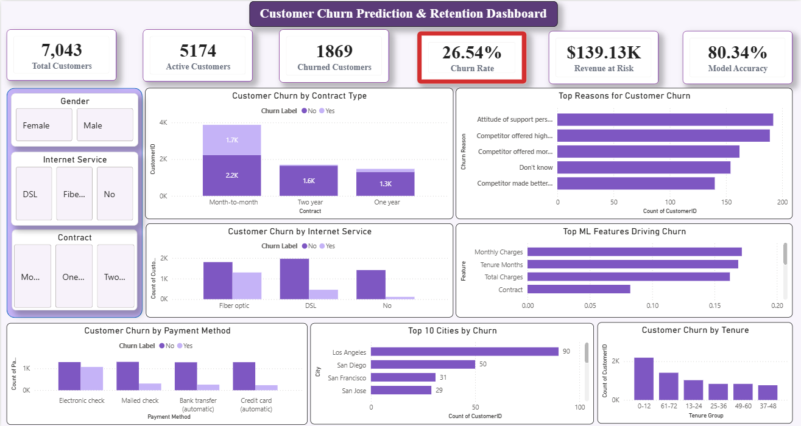
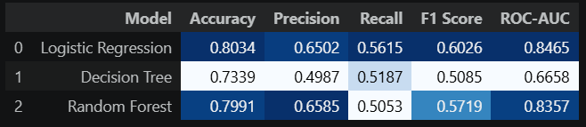
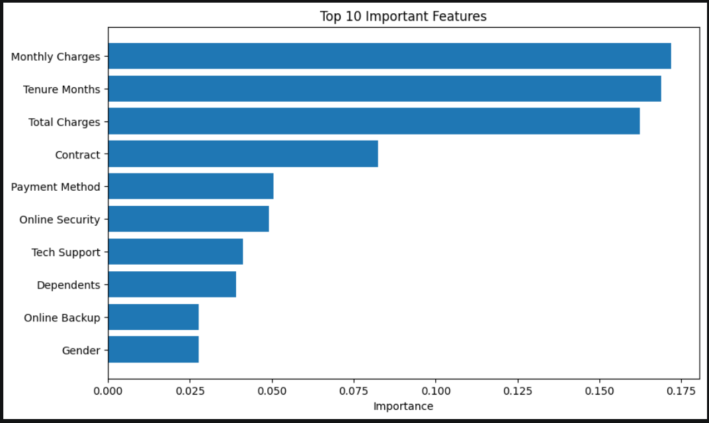

# 📊 Customer Churn Prediction & Retention Analytics

An end-to-end Business Analytics and Machine Learning project that predicts customer churn, identifies the major factors influencing customer attrition, and provides actionable business recommendations through an interactive Power BI dashboard.

---

## 📌 Project Overview

Customer churn is one of the biggest challenges faced by subscription-based businesses. Retaining existing customers is significantly more cost-effective than acquiring new ones.

This project combines **SQL, Python, Machine Learning, and Power BI** to analyze customer behavior, predict customer churn, and provide data-driven retention strategies.

The project follows a complete analytics workflow from data preprocessing to business insights and dashboard visualization.

---

## 📷 Interactive Power BI Dashboard



---

## 🤖 Machine Learning Model Comparison

The performance of three classification algorithms was evaluated to identify the most effective model for predicting customer churn.



---

## 📈 Top Features Influencing Customer Churn

Feature importance analysis highlights the variables that contribute most significantly to customer churn prediction.



---

## 🎯 Business Objectives

- Understand customer demographics and service usage.
- Identify key drivers of customer churn.
- Predict customers likely to churn using Machine Learning.
- Compare multiple classification models.
- Build an interactive Power BI dashboard for business decision-making.
- Recommend strategies to improve customer retention.

---

# 🛠️ Tech Stack

| Category | Tools & Technologies |
|-----------|----------------------|
| Programming | Python |
| Data Analysis | Pandas, NumPy |
| Data Visualization | Matplotlib, Seaborn |
| Machine Learning | Scikit-learn |
| Database | SQL |
| Dashboard | Power BI |
| Version Control | Git & GitHub |
| Notebook Environment | Jupyter Notebook |

---

# 📂 Project Structure

```text
Customer-Churn-Prediction/
│
├── data/
│   ├── raw/
│   └── cleaned/
│
├── database/
│
├── notebooks/
│   ├── 01_Data_Cleaning.ipynb
│   ├── 02_SQL_Preparation.ipynb
│   ├── 03_EDA.ipynb
│   ├── 04_Feature_Engineering_and_Preprocessing.ipynb
│   ├── 05_Model_Building_and_Evaluation.ipynb
│   └── 06_Business_Insights_and_Recommendations.ipynb
│
├── powerbi/
│
├── reports/
│
├── sql/
│
├── images/
│
├── README.md
├── requirements.txt
├── LICENSE
└── .gitignore
```

---

# 🔄 Project Workflow

```
Business Understanding
          ↓
Data Cleaning
          ↓
SQL Analysis
          ↓
Exploratory Data Analysis
          ↓
Feature Engineering
          ↓
Machine Learning
          ↓
Model Evaluation
          ↓
Business Insights
          ↓
Power BI Dashboard
```

---

# 📈 Machine Learning Models

The following classification models were trained and compared:

- Logistic Regression
- Decision Tree Classifier
- Random Forest Classifier

### ✅ Best Performing Model

**Logistic Regression**

| Metric | Score |
|---------|-------|
| Accuracy | 80.34% |
| Precision | 65.02% |
| Recall | 56.15% |
| F1 Score | 60.26% |
| ROC-AUC | 84.65% |

---

# 📊 Dashboard Features

The Power BI dashboard provides:

- Customer Overview KPIs
- Churn Rate Analysis
- Revenue at Risk
- Contract-wise Churn
- Internet Service Analysis
- Payment Method Analysis
- Customer Tenure Analysis
- Top Churn Reasons
- Top Cities by Churn
- Machine Learning Feature Importance
- Interactive Filters
- Business Recommendations

---

# 🔍 Key Business Insights

- Month-to-Month contract customers have the highest churn.
- Fiber Optic users are more likely to leave than DSL customers.
- Customers using Electronic Check show higher churn.
- Customers with shorter tenure are more likely to churn.
- Higher Monthly Charges are associated with increased churn.
- Customer support quality significantly impacts retention.

---

# 💡 Business Recommendations

- Promote long-term contracts through loyalty discounts.
- Improve Fiber Optic service quality.
- Encourage automatic payment methods.
- Strengthen customer onboarding during the first year.
- Improve customer support response time.
- Use Machine Learning predictions for proactive retention campaigns.

---

# 📁 SQL Analysis

The project includes structured SQL analysis divided into:

- Basic Business Queries
- Intermediate Analytical Queries
- Advanced SQL Queries using:
  - CTEs
  - Window Functions
  - Ranking Functions
  - Subqueries
  - CASE Statements

---

# 📚 Reports

The project documentation includes:

- Business Requirements
- Business Questions
- Data Dictionary
- Executive Summary
- Business Insights
- Model Evaluation

---

# 🚀 Future Improvements

- Hyperparameter tuning
- XGBoost and LightGBM implementation
- Model deployment using Flask/FastAPI
- Real-time churn prediction
- CRM integration
- Automated dashboard refresh

---

# ▶️ Installation

Clone the repository

```bash
git clone https://github.com/yourusername/Customer-Churn-Prediction.git
```

Navigate to the project folder

```bash
cd Customer-Churn-Prediction
```

Install dependencies

```bash
pip install -r requirements.txt
```

Launch Jupyter Notebook

```bash
jupyter notebook
```

---

# 📜 License

This project is licensed under the MIT License.

---

# 👩‍💻 Author

**Tanvi Dhanokar**

Computer Engineering Student | Aspiring Business Analyst | Data Analyst

---

⭐ If you found this project useful, consider giving it a star!